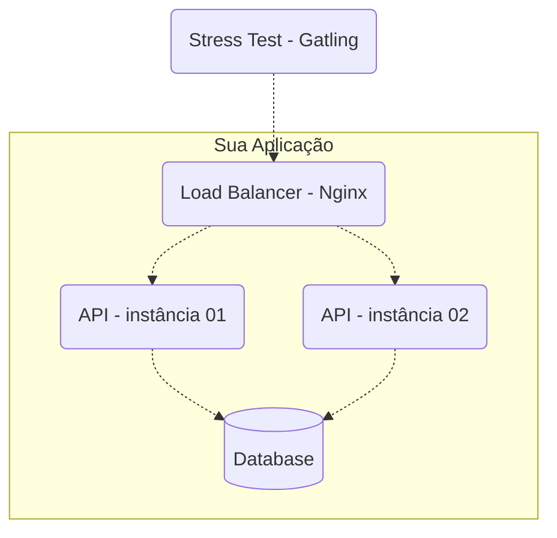

<h1 align="center">Rinha de Backend 2023 Q3</h1>


# Visão Geral do Desafio - Instruções e Regras

O objetivo deste desafio é desenvolver uma aplicação que consiga lidar com restrições de recursos e ser testada em termos de desempenho e escalabilidade.

Você precisará construir uma aplicação que expõe endpoints e utilizar o **Docker** com **docker-compose** para configurar duas instâncias dessa aplicação, além de um banco de dados para armazenar os dados recebidos. Também será necessário implementar um método que garanta a consistência das operações no banco de dados.

A aplicação deve ser configurada com o **Nginx** como servidor de **load balance**, operando na porta **9999**, que será testado com **Gatling** para estresse. O **load balancer** distribuirá as requisições entre as duas instâncias da API.

### O que Torna Este Desafio ainda Mais Interessante:

- **Limitações de Recursos**: Você terá à sua disposição apenas **1.5 CPUs** para distribuir entre os contêineres. Isso exige planejamento e otimização para garantir que sua aplicação funcione de maneira eficiente.

- **Gerenciamento de Memória**: Com **3.0GB** de memória disponível, será crucial decidir como alocar esse recurso entre os diferentes serviços, garantindo que cada um funcione adequadamente sob carga.


- **Restrições de Componentes**
O teste terá os seguintes componentes e topologia:


---

## Endpoints
As APIs precisam expor 3 (4, na verdade) endpoints:

- `POST /pessoas` – para criar um recurso pessoa.
- `GET /pessoas/[:id]` – para consultar um recurso criado com a requisição anterior.
- `GET /pessoas?t=[:termo da busca]` – para fazer uma busca por pessoas.
- `GET /contagem-pessoas` – endpoint especial para contagem de pessoas cadastradas.


### Criação de Pessoas
`POST /pessoas`

Deverá aceitar uma requisição em formato JSON com os seguintes parâmetros:

| atributo | descrição |
| --- | --- |
| **apelido** | obrigatório, único, string de até 32 caracteres. |
| **nome** | obrigatório, string de até 100 caracteres. |
| **nascimento** | obrigatório, string para data no formato AAAA-MM-DD (ano, mês, dia). |
| **stack** | opcional, vetor de string com cada elemento sendo obrigatório e de até 32 caracteres. |

Para requisições válidas, sua API deverá retornar status code 201 - created junto com o header "Location: /pessoas/[:id]" onde [:id] é o id – em formato UUID com a versão a seu critério – da pessoa que acabou de ser criada. O conteúdo do corpo fica a seu critério; retorne o que quiser.

Exemplos de requisições válidas:
```json
{
    "apelido" : "josé",
    "nome" : "José Roberto",
    "nascimento" : "2000-10-01",
    "stack" : ["C#", "Node", "Oracle"]
}
```

```json
{
    "apelido" : "ana",
    "nome" : "Ana Barbosa",
    "nascimento" : "1985-09-23",
    "stack" : null
}
```
Para requisições inválidas, o status code deve ser 422 - Unprocessable Entity/Content. Aqui, novamente, o conteúdo do corpo fica a seu critério.

Exemplos de requisições inválidas:
```json
{
    "apelido" : "josé", // caso "josé" já tenha sido criado em outra requisição
    "nome" : "José Roberto",
    "nascimento" : "2000-10-01",
    "stack" : ["C#", "Node", "Oracle"]
}
```

```json
{
    "apelido" : "ana",
    "nome" : null, // não pode ser null
    "nascimento" : "1985-09-23",
    "stack" : null
}
```

```json
{
    "apelido" : null, // não pode ser null
    "nome" : "Ana Barbosa",
    "nascimento" : "1985-01-23",
    "stack" : null
}
```

Para o caso de requisições sintaticamente inválidas, a resposta deverá ter o status code para 400 - bad request. Exemplos:

```json
{
    "apelido" : "apelido",
    "nome" : 1, // nome deve ser string e não número
    "nascimento" : "1985-01-01",
    "stack" : null
}
```

```json
{
    "apelido" : "apelido",
    "nome" : "nome",
    "nascimento" : "1985-01-01",
    "stack" : [1, "PHP"] // stack deve ser um array de apenas strings
}
```

### Detalhe de uma Pessoa
`GET /pessoas/[:id]`

Deverá retornar os detalhes de uma pessoa caso esta tenha sido criada anteriormente. O parâmetro [:id] deve ser do tipo UUID na versão que escolher. O retorno deve ser como os exemplos a seguir.


```json
{
    "id" : "f7379ae8-8f9b-4cd5-8221-51efe19e721b",
    "apelido" : "josé",
    "nome" : "José Roberto",
    "nascimento" : "2000-10-01",
    "stack" : ["C#", "Node", "Oracle"]
}
```

```json
{
    "id" : "5ce4668c-4710-4cfb-ae5f-38988d6d49cb",
    "apelido" : "ana",
    "nome" : "Ana Barbosa",
    "nascimento" : "1985-09-23",
    "stack" : null
}
```

Note que a resposta é praticamente igual ao payload de criação com o acréscimo de `id`. O status code para pessoas que existem deve ser 200 - Ok. Para recursos que não existem, deve-se retornar 404 - Not Found.


### Busca de Pessoas
`GET /pessoas?t=[:termo da busca]`

Dado o `termo da busca`, a resposta deverá ser uma lista que satisfaça o termo informado estar contido nos atributos `apelido`, `nome`, e/ou elementos de `stack`. A busca não precisa ser paginada e poderá retornar apenas os 50 primeiros registros resultantes da filtragem para facilitar a implementação.

O status code deverá ser sempre 200 - Ok, mesmo para o caso da busca não retornar resultados (vazio).

Exemplos: Dado os recursos seguintes existentes em sua aplicação:

```json
[{
    "id" : "f7379ae8-8f9b-4cd5-8221-51efe19e721b",
    "apelido" : "josé",
    "nome" : "José Roberto",
    "nascimento" : "2000-10-01",
    "stack" : ["C#", "Node", "Oracle"]
},
{
    "id" : "5ce4668c-4710-4cfb-ae5f-38988d6d49cb",
    "apelido" : "ana",
    "nome" : "Ana Barbosa",
    "nascimento" : "1985-09-23",
    "stack" : ["Node", "Postgres"]
}]
```

Uma requisição `GET /pessoas?t=node`, deveria retornar o seguinte:
```json
[{
    "id" : "f7379ae8-8f9b-4cd5-8221-51efe19e721b",
    "apelido" : "josé",
    "nome" : "José Roberto",
    "nascimento" : "2000-10-01",
    "stack" : ["C#", "Node", "Oracle"]
},
{
    "id" : "5ce4668c-4710-4cfb-ae5f-38988d6d49cb",
    "apelido" : "ana",
    "nome" : "Ana Barbosa",
    "nascimento" : "1985-09-23",
    "stack" : ["Node", "Postgres"]
}]
```

Uma requisição `GET /pessoas?t=berto`, deveria retornar o seguinte:
```json
[{
    "id" : "f7379ae8-8f9b-4cd5-8221-51efe19e721b",
    "apelido" : "josé",
    "nome" : "José Roberto",
    "nascimento" : "2000-10-01",
    "stack" : ["C#", "Node", "Oracle"]
}]
```

Uma requisição `GET /pessoas?t=Python`, deveria retornar o seguinte:
```json
[]
```

Se a query string `t` não for informada, a resposta deve ter seu status code para 400 - bad request com o corpo que quiser. Ou seja, informar `t` é obrigatório.

### Contagem de Pessoas - Endpoint Especial
`GET /contagem-pessoas`

Este é um endpoint especial que NÃO SERÁ TESTADO (portanto, não se preocupe com sua performance) e deverá retornar em texto puro o número de registros de pessoas e qq status code na faixa de 2XX. Ele será usado para validar o número de requisições de criação bem sucedidas durante o teste de stress, por isso não use cache ou qualquer outra forma de materialização que seja eventualmente consistente.

---

</br>
<h1 align="center">How to Build</h1>

- Compile o projeto antes de construir a imagem Docker

``` bash
# Constroi a imagem Docker
$ docker build -t rinha-backend:latest .

# Iniciar container a partir de uma imagem
$ docker run -p 8080:8080 rinha-backend:latest
```
---
<br/>

# ABOUT API

- **RequestHandler:**         Implementa uma interface para que uma classe possa tratar requisições.
- **SimpleRestServer:**       Responsável pela criação e gerenciamento do servidor HTTP e das rotas.
- **PessoaHandlerdetermina:** Determina como a requisição será tratada.
---
<br/>

## CASO TENHA PROBLEMAS COM PORTAS

<p>Finalize o processo que esta rodando na porta ou altere as portas da aplicação</p>

``` bash
# Mostra qual processo está utilizando a porta 8080
$ netstat -ano | findstr :8080

# Finalizar esse processo
$ taskkill /PID <PID> /F

# Exemplo
# TCP    0.0.0.0:8080    0.0.0.0:0    LISTENING    1234
$ taskkill /PID 1234 /F
```

``` bash
# Alterando as portas CONTAINER:HOST
$ docker run -p 8081:8080 rinha-backend:latest
```

``` bash
$ docker login

# Nomeia a imagem localmente:
$ docker tag rinha-backend eliasjuk/rinha-backend:1.0

# Envia a imagem para o Docker Hub:
$ docker push eliasjuk/rinha-backend:1.0

# Baixar a imagem:
$ docker pull eliasjuk/rinha-backend:1.0

# Construir e iniciar as instâncias da API:
$ docker-compose up --build
```